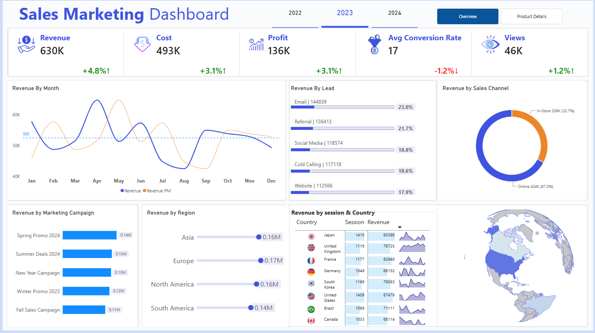
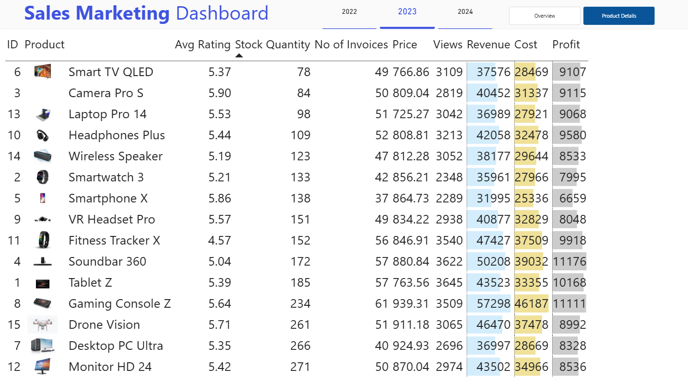

# 📊 Sales & Marketing Analytics Dashboard

A **Power BI dashboard** designed to analyze sales performance, marketing performance, customer behavior, product performance, and key business KPIs.

This project demonstrates practical skills in **data analysis, business intelligence, data visualization, and Power BI dashboard development**.

---

## 📊 Dashboard Preview

### Page 1 — Overview



The Overview page provides a high-level view of key business performance, including sales, marketing metrics, customer insights, and overall KPIs.

---

### Page 2 — Product Details



The Product Details page provides a detailed analysis of product performance, helping identify top-performing products, sales contribution, and customer-related metrics.

---


## 🛠️ Tools & Technologies

* **Power BI**
* **Power Query**
* **DAX**
* **Data Modeling**
* **Data Visualization**

---

## 📁 Project Structure

```text
Sales-Marketing-Analytics-PowerBI/
│
├── README.md
│
├── images/
│   ├── overview_dashboard.png
│   └── Product_Details_dashboard.png
│
├── sales_marketing_dashboard.pbix
│
└── dataset/
    └── # Dataset used for the dashboard
```

---

## 📈 Dashboard Pages

| Page                | Description                                           |
| ------------------- | ----------------------------------------------------- |
| **Overview**        | Overall sales, marketing,  and business KPIs          |
| **Product Details** | Detailed product and sales performance analysis       |

---

## 🎯 Project Objective

The objective of this project is to transform raw sales and marketing data into an **interactive Power BI dashboard** that enables users to monitor KPIs, identify trends, and gain actionable business insights.

---

## 💡 Key Skills Demonstrated

* Data Cleaning & Transformation
* Data Modeling
* DAX Measures
* KPI Development
* Interactive Dashboard Design
* Sales Analysis
* Marketing Analysis
* Customer Analysis
* Product Analysis
* Business Intelligence
